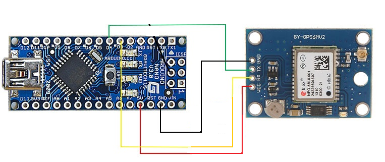

# **Arduno_nano_and_Neo6M_GPS_module-based_latitudeand_longitude_tracker**

### Wiring of NEO6M gps-Module to arduino-nao(Gps lat-long tracker):



# Source Code :
```Arduino

Source Code : 
#include <Wire.h>
#include <SoftwareSerial.h>
#include <TinyGPS++.h>

#define rxPin 4
#define txPin 3

TinyGPSPlus gps;

SoftwareSerial neogps(rxPin,txPin);

void setup() {

   Serial.begin(9600);
   neogps.begin(9600);

}

void loop() {
  Read_GPS();
}

void Read_GPS(){
  //------------------------------------------------------------------
  boolean newData = false;
  for (unsigned long start = millis(); millis() - start < 1000;)
  {
    while (neogps.available())
    {
      if (gps.encode(neogps.read()))
      {
        newData = true;
        break;
      }
    }
  }
  //------------------------------------------------------------------
  //If newData is true
  if(newData == true){
    newData = false;
    Get_GPS();
  }
  else {
    //no data
  }
}

void Get_GPS(){
   Serial.print( "(" + String(gps.location.lat(),6)+ "," + String(gps.location.lng(),6) + "),");
}

```
