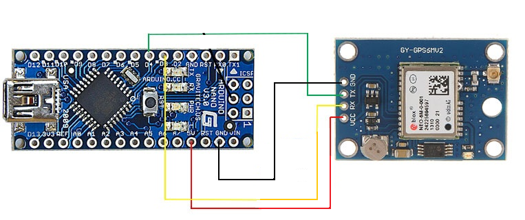

# **Arduno_nano_and_Neo6M_GPS_module-based_latitudeand_longitude_tracker**

### Wiring of NEO6M gps-Module to arduino-nao(Gps lat-long tracker):



# Source Code :
```Arduino

Source Code : 
#include <Wire.h>
#include <SoftwareSerial.h>
#include <TinyGPS++.h>

#define rxPin 3
#define txPin 4

TinyGPSPlus gps;

SoftwareSerial neogps(rxPin,txPin);

void setup() {

   Serial.begin(9600);
   neogps.begin(9600);

}

void loop() {
  Read_GPS();
}

void Read_GPS(){
  //------------------------------------------------------------------
  boolean newData = false;
  for (unsigned long start = millis(); millis() - start < 1000;)
  {
    while (neogps.available())
    {
      if (gps.encode(neogps.read()))
      {
        newData = true;
        break;
      }
    }
  }
  //------------------------------------------------------------------
  //If newData is true
  if(newData == true){
    newData = false;
    Get_GPS();
  }
  else {
    //no data
  }
}

void Get_GPS(){
   Serial.print( "(" + String(gps.location.lat(),6)+ "," + String(gps.location.lng(),6) + "),");
}

```

# Its Applications :---
### 1. Vehicle Tracking

- Used in cars, bikes, and trucks for real-time tracking.
- Can help in fleet management and anti-theft systems.
  
 ### 2. Personal Tracking
 
- Can be used to track children, elderly people, or hikers in remote locations.
  
### 3. Wildlife Tracking

- Useful in monitoring the movement of animals in conservation projects.
  
### 4. Drones & UAV Navigation
- Helps in drone autopilot systems for navigation and geofencing.

### 5. Disaster Management

- Used by rescue teams to locate people in disaster-affected areas.

### 6. Outdoor Sports & Adventure

- Used in hiking, trekking, and cycling for location tracking.
  
### 7. Geofencing & Security Applications

- Can trigger alerts when a device enters or exits a predefined location.
  
### 8. Surveying & Mapping

- Used in land surveying for position marking and GIS applications.
  
### 9. Agriculture Monitoring

- Helps in precision farming by tracking the location of equipment and monitoring fields.
  
### 10. Marine Navigation

- Used in boats and ships for location tracking on water.
