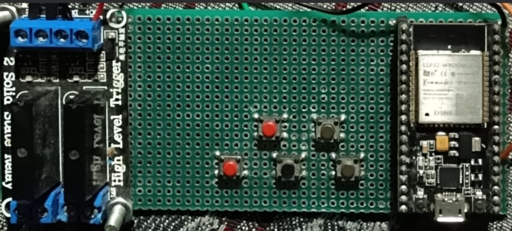

<h1>Bringing Home Automation to Web</h1>

# Introduction

Home automation systems are becoming increasingly popular, offering convenience, security, and energy efficiency by allowing users to control home appliances remotely. This project, titled **"Bringing Home Automation to Web"** leverages the ESP32 microcontroller and two channel relay module to control home appliances via a web interface. By integrating both hardware and software, users can operate devices like lights, fans, or other home electronics through a responsive web interface, making it an affordable and scalable solution for smart homes.

# Block Diagram


The block diagram for the project can be outlined as follows:

- **ESP32 Microcontroller:** Acts as the brain of the system, controlling the relays and connecting to the web server.
- **Channel Relay Module:** Interfaces with ESP32 to switch home appliances on/off.
- **Web Server:** Hosted on the ESP32 or a cloud server, the server allows communication between the user and the hardware.
- **Web Client:** A user-friendly interface accessible via any browser to control the appliances.
- **Home Appliances:** Devices like lights, fans, and other electronics controlled via relays.

<br>

# Hardware



> **NOTE:**
> Please ignore the switches. I plan to use them for manually controlling the A.C. appliance as well as through the webpage, but currently, they have no use.

<br>

# esp32_pinout


<br>

# Wiring :--- 
Loading......

<br>

# Components required :
ESP32 (38-pin)
Relay Module (5V, dual channel)
Jumper Wires
5 Volt External Power Supply (optional)

# Wiring Connections:
Relay VCC → ESP32 3.3V
Relay GND → ESP32 GND
Relay IN_1 → ESP32 GPIO 2
Relay IN_2 → ESP32 GPIO 15
Relay out_1 → A.C_Appliance_1
Relay out_2 → A.C_Appliance_2

# UI to Control Electric Appliances


# Working Principle

The ESP32 microcontroller serves as a bridge between the web interface and the relay module. When a user interacts with the web page (e.g., pressing a button to turn on/off a device), the command is sent to the web server running on the ESP32. The ESP32 processes the command and activates the corresponding relay, switching the connected appliance on or off. This real-time communication between hardware and software allows for seamless home automation.

## Advantages:
- **Remote Access**: Users can control their home appliances from anywhere using a web interface.
- **Cost-effective**: Uses affordable components like the ESP32 and relay modules.
- **Scalability**: The system can be expanded by adding more relays to control more devices.
- **User-friendly Interface**: Accessible from any device with a browser, ensuring ease of use.
- **Low Power Consumption**: ESP32 and relays are energy efficient.

## Disadvantages:
- **Security Concerns**: If not properly secured, the system could be vulnerable to cyber-attacks.
- **Limited Range of Relay Modules**: Depending on the relay module used, there might be restrictions on the voltage and current of appliances.

## Future Work:
- **Integration with Voice Assistants**: Adding support for voice control via assistants like Google Home or Amazon Alexa.
- **Mobile App Development**: Creating a dedicated mobile app for easier control and notifications.
- **IoT Integration**: Connecting the system to other IoT platforms like MQTT for enhanced automation and data logging.
- **Enhanced Security Measures**: Implementing SSL encryption and authentication systems to ensure secure remote access.
- **Energy Monitoring**: Integrating sensors to monitor energy consumption of the appliances and display real-time data to the user.
- **Energy Monitoring**: We can increase the number of real and gpio pins _Using a GPIO Expander_

## Source Code :
```cpp
```cpp
#include <WiFi.h>
#include <ESPmDNS.h>
#include <WebSocketsServer.h>
#include <ArduinoJson.h>

#define LED1 2
#define LED2 15

char webpage[] PROGMEM = R"=====(
<!DOCTYPE html>
<html>
<head>
  <style>
    body {
      font-family: Arial, sans-serif;
      background-color: #f0f0f0;
      margin: 0;
      padding: 0;
    }

    h1 {
      color: #333;
      margin-bottom: 40px;
    }

    center {
      margin-top: 50px;
    }

    button {
      padding: 10px 20px;
      font-size: 16px;
      margin: 10px;
      border-radius: 5px;
      border: none;
      background-color: #007bff;
      color: white;
      cursor: pointer;
      transition: background-color 0.3s ease;
    }

    button:hover {
      background-color: #0056b3;
    }

    h3 {
      color: #555;
      margin-bottom: 10px;
    }

    .container {
      background-color: #fff;
      padding: 30px;
      box-shadow: 0px 4px 8px rgba(0, 0, 0, 0.1);
      border-radius: 10px;
      width: 300px;
      margin: auto;
    }
  </style>
</head>

<script>
  var connection = new WebSocket('ws://' + location.hostname + ':81/');

  var button_1_status = 0;
  var button_2_status = 0;

  function button_1_on() {
    button_1_status = 1;
    console.log("LED 1 is ON");
    send_data();
  }

  function button_1_off() {
    button_1_status = 0;
    console.log("LED 1 is OFF");
    send_data();
  }

  function button_2_on() {
    button_2_status = 1;
    console.log("LED 2 is ON");
    send_data();
  }

  function button_2_off() {
    button_2_status = 0;
    console.log("LED 2 is OFF");
    send_data();
  }

  function send_data() {
    var full_data = '{"LED1" :' + button_1_status + ',"LED2":' + button_2_status + '}';
    connection.send(full_data);
  }
</script>

<body>
  <center>
    <div class="container">
      <h1>My Home Automation</h1>

      <h3> LED 1 </h3>
      <button onclick="button_1_on()">On</button>
      <button onclick="button_1_off()">Off</button>

      <h3> LED 2 </h3>
      <button onclick="button_2_on()">On</button>
      <button onclick="button_2_off()">Off</button>
    </div>
  </center>
</body>

</html>
)=====";

#include <ESPAsyncWebServer.h>

AsyncWebServer server(80);  // Server port 80
WebSocketsServer websockets(81);  // WebSocket server at port 81

void notFound(AsyncWebServerRequest *request) {
  request->send(404, "text/plain", "Page Not found");
}

void webSocketEvent(uint8_t num, WStype_t type, uint8_t *payload, size_t length) {
  switch (type) {
    case WStype_DISCONNECTED:
      Serial.printf("[%u] Disconnected!\n", num);
      break;
    case WStype_CONNECTED: {
      IPAddress ip = websockets.remoteIP(num);
      Serial.printf("[%u] Connected from %d.%d.%d.%d url: %s\n", num, ip[0], ip[1], ip[2], ip[3], payload);
      websockets.sendTXT(num, "Connected from server");
      break;
    }
    case WStype_TEXT:
      Serial.printf("[%u] Received Text: %s\n", num, payload);
      String message = String((char*)(payload));
      Serial.println(message);

      DynamicJsonDocument doc(200);
      DeserializationError error = deserializeJson(doc, message);

      if (error) {
        Serial.print("deserializeJson() failed: ");
        Serial.println(error.c_str());
        return;
      }

      int LED1_status = doc["LED1"];
      int LED2_status = doc["LED2"];
      digitalWrite(LED1, LED1_status);
      digitalWrite(LED2, LED2_status);
      break;
  }
}

void setup(void) {
  Serial.begin(115200);
  pinMode(LED1, OUTPUT);
  pinMode(LED2, OUTPUT);

  const char* ssid = "college_project";
  const char* password = "8918172922";

  WiFi.softAP(ssid, password);
  Serial.print("AP IP: ");
  Serial.println(WiFi.softAPIP());

  if (MDNS.begin("college_project")) {
    Serial.println("MDNS responder started");
  } else {
    Serial.println("Error starting mDNS");
  }

  server.on("/", [](AsyncWebServerRequest *request) {
    request->send_P(200, "text/html", webpage);
  });

  server.onNotFound(notFound);
  server.begin();

  websockets.begin();
  websockets.onEvent(webSocketEvent);
}

void loop(void) {
  websockets.loop();
}
```

# Library used Details

### WiFi.h
The `WiFi.h` library is essential for enabling the ESP32 to connect to Wi-Fi networks. This library handles all Wi-Fi-related functions, such as scanning available networks, connecting to a specific network, and handling network events. It provides functions for both station mode (ESP32 connects to a router) and access point mode (ESP32 creates a Wi-Fi network). This library is key to establishing communication between the ESP32 and the web interface.

**Key Functions:**
- `WiFi.begin(ssid, password)`: Connects to a specified Wi-Fi network.
- `WiFi.status()`: Checks the status of the Wi-Fi connection.
- `WiFi.disconnect()`: Disconnects from the current network.

### ESPmDNS.h
The `ESPmDNS.h` library allows the ESP32 to use the mDNS (multicast DNS) protocol, which helps in resolving the ESP32’s IP address to a human-readable domain name. This is particularly useful in this project since it allows users to access the ESP32 server via a URL (e.g., `http://esp32.local`) instead of an IP address, making the system more user-friendly.

**Key Functions:**
- `MDNS.begin("esp32")`: Starts the mDNS responder, enabling the ESP32 to be accessed via a hostname.
- `MDNS.addService()`: Registers a service for the ESP32 (e.g., HTTP server).

### WebSocketServer.h
The `WebSocketServer.h` library is used to create a WebSocket server on the ESP32. WebSockets allow for real-time, two-way communication between the ESP32 and the web client, providing an efficient means to send and receive data asynchronously. This is critical in this project as it allows the ESP32 to control the relays and instantly update the web interface without needing to refresh the page.

**Key Functions:**
- `webSocket.begin()`: Initializes the WebSocket server.
- `webSocket.onEvent()`: Attaches a function to handle WebSocket events (e.g., data received from the client).
- `webSocket.broadcast()`: Sends data to all connected clients in real-time.

### ArduinoJson.h
The `ArduinoJson.h` library simplifies working with JSON (JavaScript Object Notation) data structures. JSON is commonly used for transmitting data between the web interface and the ESP32. This library allows the ESP32 to parse incoming JSON data and generate JSON responses. In this project, it can be used to send data such as the status of appliances or receive control commands from the web interface.

**Key Functions:**
- `JsonDocument`: Represents the JSON structure in memory.
- `serializeJson()`: Converts the JSON object into a string for transmission.
- `deserializeJson()`: Parses a JSON string into a JSON object for easier manipulation.
