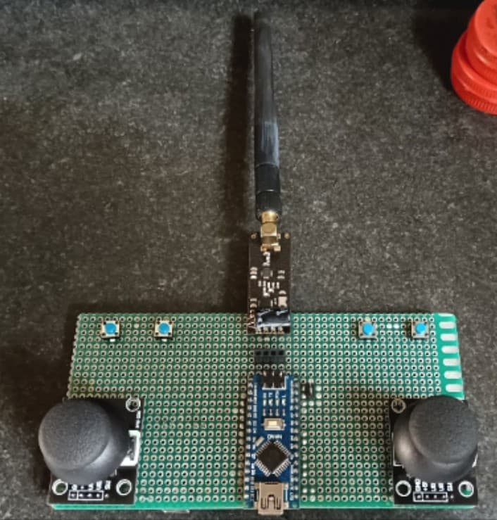
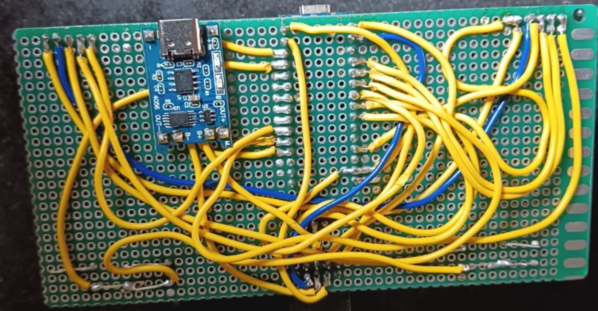
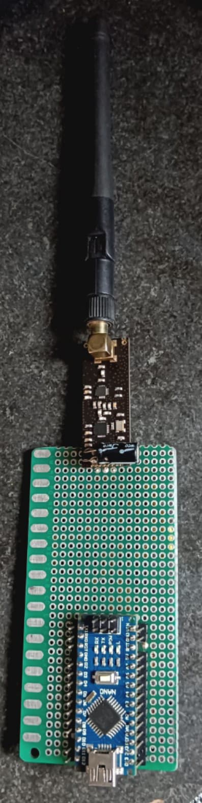
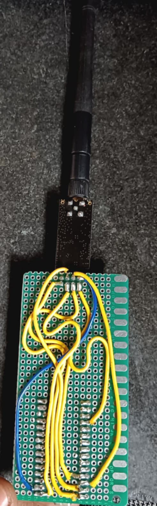

# Transmitter Wiring

**Microcontroller:** Arduino Nano  

### NRF24L01 Module:
- **VCC** → 3.3V  
- **GND** → GND  
- **CE**  → D9  
- **CSN** → D10  
- **SCK** → D13  
- **MOSI** → D11  
- **MISO** → D12  

### Serial Output:
- **USB** → Computer (For JSON data transmission)

---

# Receiver Wiring

**Microcontroller:** Arduino Nano  

### NRF24L01 Module:
- **VCC** → 3.3V  
- **GND** → GND  
- **CE**  → D9  
- **CSN** → D10  
- **SCK** → D13  
- **MOSI** → D11  
- **MISO** → D12  

### Joystick 1:
- **VRx** → A1  
- **VRy** → A0  
- **SW**  → D2  

### Joystick 2:
- **VRx** → A3  
- **VRy** → A2  
- **SW**  → D3  

### Switches:
- **SW1** → D4  
- **SW2** → D5  
- **SW3** → D6  
- **SW4** → D7  
*(All switches' other side connected to GND)*

---

# Images

## Transmitter
| Front View | Back View |
|------------|-----------|
|  |  |

## Receiver
| Front View | Back View |
|------------|-----------|
|  |  |