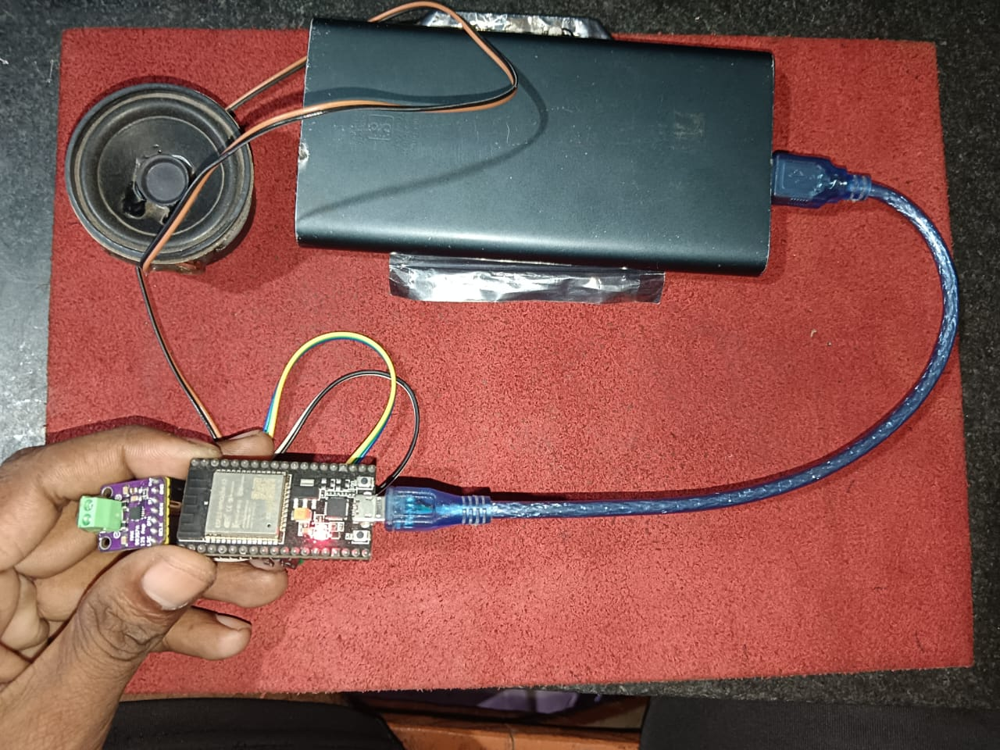

# Super Mario Bros. Theme Player using ESP32 and I2S

This project plays the iconic Super Mario Bros. theme song using the ESP32's I2S peripheral to output audio. It generates square waves corresponding to musical notes and sends them as stereo audio over I2S.

## Features

* Plays a portion of the Super Mario Bros. theme
* Generates audio using square wave synthesis
* Uses ESP32 I2S peripheral (no external DAC required)
* Supports adjustable volume

## Hardware Requirements

* ESP32 development board
* I2S-compatible DAC module, speaker, or amplifier
* Jumper wires

## I2S Pin Configuration

| Function | GPIO Pin |
| -------- | -------- |
| BCLK     | GPIO 25  |
| LRCK     | GPIO 26  |
| DOUT     | GPIO 27  |
| VCC      | 3.3v/5v  |
| GND      |   GND    |

## Source Code 

```c
#include <driver/i2s.h>

// Note frequencies (in Hz) for Super Mario Bros. theme
#define NOTE_C4  262
#define NOTE_CS4 277
#define NOTE_D4  294
#define NOTE_DS4 311
#define NOTE_E4  330
#define NOTE_F4  349
#define NOTE_FS4 370
#define NOTE_G4  392
#define NOTE_GS4 415
#define NOTE_A4  440
#define NOTE_AS4 466
#define NOTE_B4  494
#define NOTE_C5  523
#define NOTE_CS5 554
#define NOTE_D5  587
#define NOTE_DS5 622
#define NOTE_E5  659
#define NOTE_F5  698
#define NOTE_FS5 740
#define NOTE_G5  784
#define NOTE_GS5 831
#define NOTE_A5  880
#define NOTE_AS5 932
#define NOTE_B5  988
#define NOTE_C6  1047
#define REST     0

// Tempo (beats per minute)
const int tempo = 55;

// Melody array: note (frequency), duration (4 = quarter note, etc.)
const int melody[] = {
  NOTE_E5, 8, NOTE_E5, 8, REST, 8, NOTE_E5, 8, REST, 8, NOTE_C5, 8, NOTE_E5, 8, REST, 8,
  NOTE_G5, 4, REST, 4, NOTE_G4, 8, REST, 4,
  NOTE_C5, -4, NOTE_G4, 8, REST, 4, NOTE_E4, -4,
  NOTE_A4, 4, NOTE_B4, 4, NOTE_AS4, 8, NOTE_A4, 8,
  NOTE_G4, -8, NOTE_E5, -8, NOTE_G5, -8, NOTE_A5, 4, NOTE_F5, 8, NOTE_G5, 8,
  REST, 8, NOTE_E5, 4, NOTE_C5, 8, NOTE_D5, 8, NOTE_B4, -4,
  
  // Repeat Mario theme part
  NOTE_E5, 8, NOTE_E5, 8, REST, 8, NOTE_E5, 8, REST, 8, NOTE_C5, 8, NOTE_E5, 8, REST, 8,
  NOTE_G5, 4, REST, 4, NOTE_G4, 8, REST, 4,
  NOTE_C5, -4, NOTE_G4, 8, REST, 4, NOTE_E4, -4,
  NOTE_A4, 4, NOTE_B4, 4, NOTE_AS4, 8, NOTE_A4, 8,
  NOTE_G4, -8, NOTE_E5, -8, NOTE_G5, -8, NOTE_A5, 4, NOTE_F5, 8, NOTE_G5, 8,
  REST, 8, NOTE_E5, 4, NOTE_C5, 8, NOTE_D5, 8, NOTE_B4, -4
};

const int melodySize = sizeof(melody) / sizeof(melody[0]) / 2;

const int sampleRate = 16000;
int amplitude = 3000; // Default amplitude (can be changed via setVolume)

// I2S pin configuration
#define I2S_BCLK 25
#define I2S_LRCK 26
#define I2S_DOUT 27

// Function to set volume from 0 (mute) to 100 (full volume)
void setVolume(int percent) {
  if (percent < 0) percent = 0;
  if (percent > 100) percent = 100;

  // Maximum amplitude for 16-bit I2S is 32767, scale to 90% to avoid clipping
  amplitude = (int)(32767 * (percent / 100.0) * 0.9);
}

void setup() {
  Serial.begin(115200);
  Serial.println("Super Mario Bros. Theme (ESP32 I2S)");

  setVolume(20); // 🔊 Set initial volume to 20% (adjust as needed)

  i2s_config_t i2s_config = {
    .mode = (i2s_mode_t)(I2S_MODE_MASTER | I2S_MODE_TX),
    .sample_rate = sampleRate,
    .bits_per_sample = I2S_BITS_PER_SAMPLE_16BIT,
    .channel_format = I2S_CHANNEL_FMT_RIGHT_LEFT,
    .communication_format = I2S_COMM_FORMAT_STAND_I2S,
    .intr_alloc_flags = 0,
    .dma_buf_count = 8,
    .dma_buf_len = 64,
    .use_apll = false,
    .tx_desc_auto_clear = true,
    .fixed_mclk = 0
  };

  i2s_pin_config_t pin_config = {
    .bck_io_num = I2S_BCLK,
    .ws_io_num = I2S_LRCK,
    .data_out_num = I2S_DOUT,
    .data_in_num = I2S_PIN_NO_CHANGE
  };

  i2s_driver_install(I2S_NUM_0, &i2s_config, 0, NULL);
  i2s_set_pin(I2S_NUM_0, &pin_config);
}

void loop() {
  for (int i = 0; i < melodySize; i++) {
    int note = melody[i * 2];
    int duration = melody[i * 2 + 1];

    float noteDuration = (duration > 0) ? (1000.0 / tempo * 60.0 / duration)
                                        : (-1000.0 / tempo * 60.0 / duration * 1.5);
    int samples = (int)(noteDuration * sampleRate / 1000.0);

    if (note == REST) {
      for (int j = 0; j < samples; j++) {
        short silence[2] = {0, 0};
        size_t bytes_written;
        i2s_write(I2S_NUM_0, silence, sizeof(silence), &bytes_written, portMAX_DELAY);
      }
    } else {
      int halfWavelength = sampleRate / (note * 2);
      int16_t sample = amplitude;

      for (int j = 0; j < samples; j++) {
        if (j % halfWavelength == 0) {
          sample = -sample;
        }
        short stereo[2] = {sample, sample};
        size_t bytes_written;
        i2s_write(I2S_NUM_0, stereo, sizeof(stereo), &bytes_written, portMAX_DELAY);
      }
    }

    // Short pause between notes
    int pauseSamples = (int)(noteDuration * 0.1 * sampleRate / 1000.0);
    for (int j = 0; j < pauseSamples; j++) {
      short silence[2] = {0, 0};
      size_t bytes_written;
      i2s_write(I2S_NUM_0, silence, sizeof(silence), &bytes_written, portMAX_DELAY);
    }
  }

  delay(200); // Repeat after 200ms (adjust if needed)
}
```

## Musical Note Definitions

Defined using frequency values in Hz:

```c
// Note frequencies (in Hz) for Super Mario Bros. theme
#define NOTE_C4  262
#define NOTE_CS4 277
#define NOTE_D4  294
#define NOTE_DS4 311
#define NOTE_E4  330
#define NOTE_F4  349
#define NOTE_FS4 370
#define NOTE_G4  392
#define NOTE_GS4 415
#define NOTE_A4  440
#define NOTE_AS4 466
#define NOTE_B4  494
#define NOTE_C5  523
#define NOTE_CS5 554
#define NOTE_D5  587
#define NOTE_DS5 622
#define NOTE_E5  659
#define NOTE_F5  698
#define NOTE_FS5 740
#define NOTE_G5  784
#define NOTE_GS5 831
#define NOTE_A5  880
#define NOTE_AS5 932
#define NOTE_B5  988
#define NOTE_C6  1047
#define REST     0
```

## Melody Array

The melody is stored as a sequence of note-frequency and note-duration pairs. Example:

```c
// Melody array: note (frequency), duration (4 = quarter note, etc.)
const int melody[] = {
  NOTE_E5, 8, NOTE_E5, 8, REST, 8, NOTE_E5, 8, REST, 8, NOTE_C5, 8, NOTE_E5, 8, REST, 8,
  NOTE_G5, 4, REST, 4, NOTE_G4, 8, REST, 4,
  NOTE_C5, -4, NOTE_G4, 8, REST, 4, NOTE_E4, -4,
  NOTE_A4, 4, NOTE_B4, 4, NOTE_AS4, 8, NOTE_A4, 8,
  NOTE_G4, -8, NOTE_E5, -8, NOTE_G5, -8, NOTE_A5, 4, NOTE_F5, 8, NOTE_G5, 8,
  REST, 8, NOTE_E5, 4, NOTE_C5, 8, NOTE_D5, 8, NOTE_B4, -4,
  
  // Repeat Mario theme part
  NOTE_E5, 8, NOTE_E5, 8, REST, 8, NOTE_E5, 8, REST, 8, NOTE_C5, 8, NOTE_E5, 8, REST, 8,
  NOTE_G5, 4, REST, 4, NOTE_G4, 8, REST, 4,
  NOTE_C5, -4, NOTE_G4, 8, REST, 4, NOTE_E4, -4,
  NOTE_A4, 4, NOTE_B4, 4, NOTE_AS4, 8, NOTE_A4, 8,
  NOTE_G4, -8, NOTE_E5, -8, NOTE_G5, -8, NOTE_A5, 4, NOTE_F5, 8, NOTE_G5, 8,
  REST, 8, NOTE_E5, 4, NOTE_C5, 8, NOTE_D5, 8, NOTE_B4, -4
};
```

Durations:

* 4: Quarter note
* 8: Eighth note
* -4: Dotted quarter note

## Volume Control

Function to set output volume (0–100%):

```c
void setVolume(int percent);
```

Volume is internally scaled to avoid clipping on 16-bit audio.

## Initialization (setup function)

* Initializes serial output
* Configures I2S driver with 16kHz sample rate
* Sets volume to 20%
* Installs I2S driver and sets pin configuration

## Main Loop (loop function)

* Iterates through each note in the melody
* For each note:

  * Calculates duration based on tempo
  * If REST, outputs silence
  * Otherwise, generates square wave by toggling polarity at half wavelength
  * Sends audio samples to both left and right channels
* Adds a short pause between notes
* Repeats the theme after a short delay

## Audio Output Logic

* Uses `i2s_write()` to write 16-bit stereo samples
* Square wave generation toggles between `+amplitude` and `-amplitude`
* Silence is represented with zero values for both channels

## Video Link : 

<a href="https://youtube.com/shorts/ADMT5xilM9w?si=s5NI9hk7cQvO9r5N" target="_blank" title="Click to watch ESP32 play the Mario theme using MAX98357">
  
</a>


## Adjustments

* Change `tempo` to speed up or slow down the melody
* Use `setVolume(percent)` to change volume dynamically
* Modify the `melody[]` array to add or change notes

## License

This project is intended for educational and non-commercial use only.

---

**Developed for ESP32 with Arduino framework**

Enjoy the nostalgia! 🍄🎵
